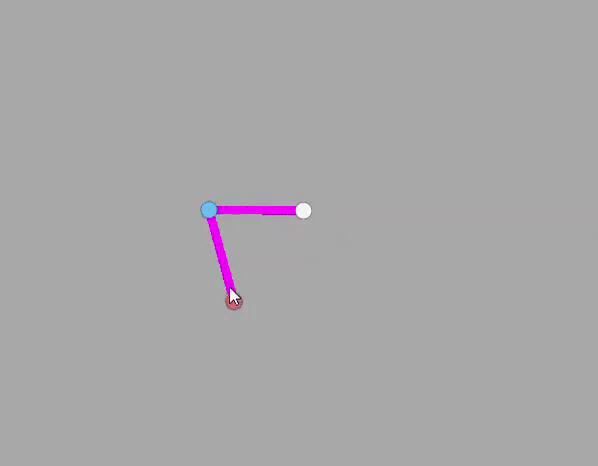

# Unity_2DIKSolver
Package containing a simple 2D Inverse Kinematics solver for Unity3D.

## Contents
**IkSolver2D.cs**: script containing the 2D IK solver. Drop into a GameObject and read the notes in the inspector to set it up.
**IkTargetController.cs**: controls the target position with the mouse (made for debugging). Drop into the *target* GameObject.

## Example

